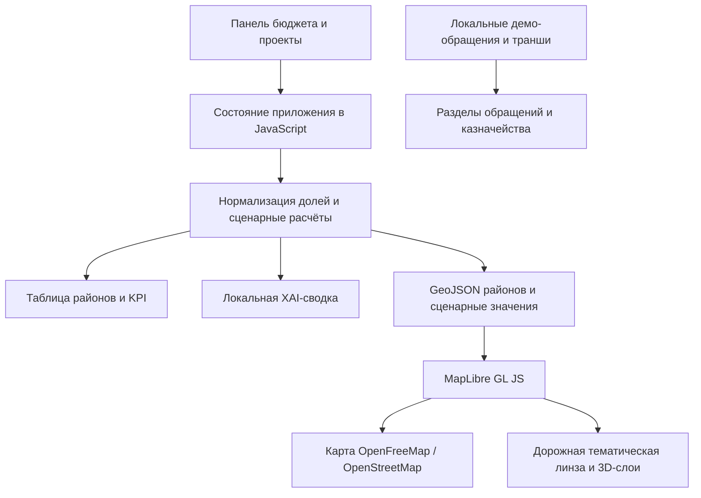

# Astana Digital Twin — Executive Command Center

Интерактивная браузерная демонстрация цифрового пульта Астаны. Страница показывает, как распределение городского бюджета может быть связано с районными показателями, уличной сетью, обращениями жителей и финансовым календарём. Проект рассчитан на демонстрацию сценарного подхода городским руководителям, экспертам и жюри хакатона.

> Текущая реализация — одностраничное демо на HTML, CSS и JavaScript. Финансовые, районные и транспортные значения в ней модельные, а не официальная статистика.

## 1. Название проекта

**Astana Digital Twin — Executive Command Center**

## 2. Краткое описание

Городскому руководителю важно быстро понять, как выбор бюджетных приоритетов может отразиться на районах и ключевых городских показателях. Приложение даёт интерактивную демонстрацию такого сценарного анализа: пользователь меняет доли бюджета и видит пересчитанные индексы, тематическую карту и сводку последствий.

## 3. Что реализовано

- Панель бюджета на пять направлений: транспорт, экология, социальная сфера и образование, ЖКХ и инфраструктура, общественная безопасность.
- Ввод бюджета в процентах или миллиардах тенге. Доли автоматически нормализуются до 100%; базовый городской бюджет в демо — 142,5 млрд ₸.
- Сценарный перерасчёт пяти районов: Есиль, Нура, Алматы, Сарыарка и Байконур. Таблица показывает QoL, пробки, AQI, обращения и социальный индекс.
- Выбор горизонта расчёта и демонстрационных проектов: BRT, школа, парк и поликлиника.
- Интерактивная карта на данных OpenStreetMap через OpenFreeMap и MapLibre GL JS. Доступны стилизованные дороги, границы и подписи районов, демонстрационные объекты и обращения, а также 3D-выдавливание зданий из картографического слоя.
- Линзы карты: трафик, экология AQI, соцсфера, ЖКХ и QoL. В режиме трафика дорожные линии окрашиваются по шкале от зелёного до красного; другие линзы окрашивают районы по выбранному показателю.
- Переключатель границ районов и подписей.
- Казначейский раздел с демонстрационным балансом и графиком траншей.
- Раздел обращений с примерами eOtinish/109 и формой для добавления локальной демонстрационной записи.
- Локальная объяснимая сводка: риски, положительные эффекты и рекомендация. Текст строится по правилам на рассчитанных в браузере данных.

## 4. Как работает решение

1. Пользователь задаёт доли бюджета, выбирает горизонт и при необходимости включает проекты.
2. JavaScript нормализует доли и локально пересчитывает показатели каждого района.
3. Новые значения отображаются в таблице, KPI и выбранной тематической линзе карты.
4. Пользователь изучает районы и дороги, выбирает район в фокусе или открывает демонстрационные обращения и транши.
5. Локальный аналитический блок формирует сводку на основе тех же модельных значений.

## 5. Технологии

- **HTML5** — разметка страницы и компонентов.
- **CSS** — адаптивная тёмная тема и оформление интерфейса.
- **JavaScript (без фреймворка)** — состояние приложения, нормализация бюджета, расчёт показателей, обработчики и локальная аналитика.
- **MapLibre GL JS 5.6.1** — интерактивная векторная карта, стилизация дорожных линий, подписи и 3D-слой зданий.
- **OpenFreeMap Liberty** — картографический стиль и векторная подложка.
- **OpenStreetMap** — географические данные с отображением атрибуции.
- **Google Fonts: Manrope и DM Mono** — шрифты интерфейса.
- **Python `http.server`** — необязательный локальный статический сервер для запуска страницы.

В текущем `real-city.html` нет Streamlit, PyDeck, OpenAI SDK, серверного API или подключённой AI-модели. `requirements.txt` содержит Python-пакеты Streamlit, Pandas, PyDeck и OpenAI, но эта HTML-страница их не использует; для её запуска устанавливать эти зависимости не нужно. Файл `app.py` в текущем проекте отсутствует.

## 6. Архитектура проекта

Приложение поставляется одной страницей `real-city.html`. Основные части и порядок обмена данными:



Внешняя карта загружается отдельно от модельных данных. Сценарные расчёты, демонстрационные обращения, финансовые транши и XAI-анализ выполняются в браузере и не отправляются на backend.

## 7. Установка и запуск

Для страницы не нужны Node.js, сборщик, виртуальное окружение или установка Python-пакетов. Нужен Python 3, если запускаете встроенный статический сервер.

1. Клонируйте репозиторий и перейдите в его папку:

   ```bash
   git clone <URL-репозитория>
   cd <папка-репозитория>
   ```

2. Запустите сервер из корня проекта:

   ```bash
   python -m http.server 8888
   ```

   В Windows, если команда `python` не настроена, используйте:

   ```powershell
   py -m http.server 8888
   ```

3. Откройте в браузере [http://localhost:8888/real-city.html](http://localhost:8888/real-city.html).

Чтобы остановить сервер, нажмите `Ctrl+C` в терминале. Для загрузки картографической подложки, шрифтов и MapLibre требуется интернет-соединение.

## 8. Как проверить решение

Короткий сценарий для жюри:

1. Измените бюджетные ползунки, например увеличьте транспорт и уменьшите ЖКХ. Проверьте, что нормализованная сумма остаётся 100%, а значения в таблице районов пересчитываются.
2. Оставьте линзу **«Трафик»**: дороги OSM окрасятся по оценочной шкале зелёный → жёлтый → оранжевый → красный. Нажмите на дорогу, чтобы увидеть её класс и демонстрационную оценку нагрузки.
3. Переключите линзу на **«Экология AQI»**, **«Соцсфера»**, **«ЖКХ»** или **«QoL»**. Вместо дорожной раскраски карта покажет районные значения и обновит легенду.
4. Нажмите **«Границы районов»**, чтобы показать или скрыть контуры и подписи пяти районов.
5. Откройте вкладки **«Казначейство»**, **«Обращения»** и **«XAI»**; в обращениях можно добавить тестовую локальную запись.

## 9. Данные и интеграции

- **Карта и дорожная геометрия:** векторная подложка OpenFreeMap Liberty на данных OpenStreetMap. Дорожные линии окрашиваются по классу улицы и общей сценарной транспортной нагрузке.
- **Районы:** пять районов, их координаты и упрощённые полигоны заданы в коде страницы.
- **Транспорт, AQI, социальные, коммунальные и QoL-значения:** демонстрационные коэффициенты и локальные расчёты в JavaScript.
- **Обращения и финансовые транши:** примеры записаны в коде; добавление обращения и отметка транша об оплате действуют только в текущей сессии страницы.
- **Внешние ресурсы интерфейса:** CDN MapLibre GL JS и Google Fonts; картографический стиль и тайлы OpenFreeMap.

Интеграций с API 2ГИС, датчиками качества воздуха, eOtinish/109, OpenAI или другой LLM в текущем HTML-коде нет. Цвет дорожного трафика не является live-данными 2ГИС; это демонстрационная оценка по классу дороги и среднему сценарию. Если интернет недоступен, внешняя карта и шрифты могут не загрузиться, но локальные элементы и расчёты остаются в странице.

## 10. Ограничения

- Значения бюджета, QoL, загруженности дорог, AQI, социальной сферы, ЖКХ, обращений и траншей демонстрационные; они не являются официальными данными.
- Трафик визуализируется на реальных дорожных линиях OSM, но оценка нагрузки синтетическая и задаётся классом дороги с поправкой на среднюю сценарную нагрузку. Покрытие не отражает фактические пробки по времени и направлению.
- Геометрия районов упрощена и хранится в коде; её нельзя использовать для кадастровых или административных задач.
- Локальные изменения обращений и статусов траншей не сохраняются после перезагрузки страницы.
- Нет backend, базы данных, авторизации, совместной работы пользователей и внешнего источника обновляемой статистики.
- XAI — набор локальных правил и шаблонов, а не генеративная AI-модель и не официальный прогноз.
- Карта, шрифты и библиотеки загружаются из внешних сервисов.

Возможные направления развития: официальные геоданные районов, подтверждённые API трафика и AQI, серверное хранение данных, сценарии с историческими периодами и аудит математических коэффициентов.

## 11. Ссылка на deployed-версию

В текущих файлах репозитория публичный адрес развёрнутой версии не указан. После запуска локально страница доступна по адресу [http://localhost:8888/real-city.html](http://localhost:8888/real-city.html); этот адрес доступен только на машине, где запущен сервер.
